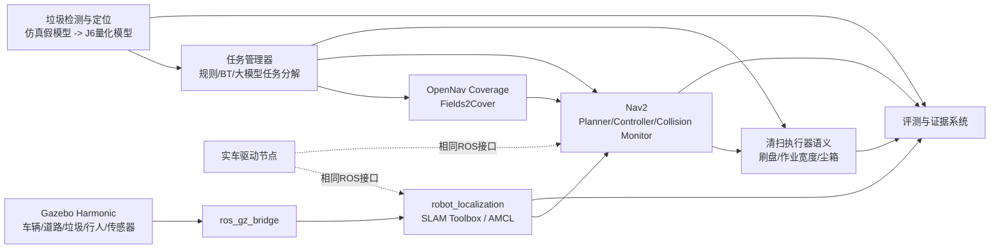

# 项目技术规范：智慧环卫无人清扫车仿真主线

## 1. 目标

构建一套面向“仿真 + 实车”并行开发的 ROS 2 仿真底座，使同一套上层算法可以在 Gazebo 和实车之间切换。第一轮目标不是追求高精度外观模型，而是先完成：

1. 可运行的清扫车 URDF/Xacro；
2. 可复现的环卫场景；
3. 建图、定位、导航、循迹和区域全覆盖；
4. 感知接口和垃圾对象真值；
5. 动态避障、急停和任务恢复；
6. 自动化指标采集；
7. 为地平线 J6 推理节点预留 ROS 2 接口。

## 2. 架构

## 3. 主接口

### 3.1 底盘与传感器

- `/cmd_vel_gate` — `geometry_msgs/msg/Twist`，Nav2/任务侧进入最终安全门的命令
- `/cmd_vel` — `geometry_msgs/msg/Twist`，仅由最终安全门向车辆发布
- `/odom/unfiltered` — `nav_msgs/msg/Odometry`，保留的原始轮速里程计
- `/measurements/wheel_odom` — `nav_msgs/msg/Odometry`，规范 frame 并注入非零 covariance 的轮速量测
- `/measurements/imu` — `sensor_msgs/msg/Imu`，规范 frame 并注入非零 covariance 的 IMU 量测
- `/odom` — `nav_msgs/msg/Odometry`，selected EKF 的融合输出
- `/ground_truth/odom` — `nav_msgs/msg/Odometry`，仅用于评分；除显式 `oracle_only` 隔离通道外不得参与控制
- `/tf`, `/tf_static`
- `/scan` — `sensor_msgs/msg/LaserScan`
- `/imu/data` — `sensor_msgs/msg/Imu`，永久保留的原始 IMU topic
- `/camera/color/image_raw`
- `/camera/color/camera_info`
- `/camera/depth/image_rect_raw`
- `/camera/depth/color/points`

### 3.2 环卫任务接口

第一阶段允许使用标准消息，后续再固化自定义 action。

- `/cleaning/enable` — `std_msgs/msg/Bool`
- `/cleaning/brush_speed` — `std_msgs/msg/Float32`
- `/cleaning/bin_fill_ratio` — `std_msgs/msg/Float32`
- `/emergency_stop` — `std_msgs/msg/Bool`
- `/garbage/detections_2d` — `vision_msgs/msg/Detection2DArray`
- `/garbage/targets` — `geometry_msgs/msg/PoseArray`
- `/coverage/path` — `nav_msgs/msg/Path`
- `/metrics/coverage_ratio` — `std_msgs/msg/Float32`

### 3.3 J6 推理边界

J6 节点只承担推理和必要预处理，保持与仿真/主控解耦：

输入：

- 图像或压缩图像；
- 可选深度图；
- 模型配置与阈值。

输出：

- `vision_msgs/msg/Detection2DArray`；
- 可选 `Detection3DArray`；
- 运行耗时、置信度、模型版本和量化版本。

## 4. 车辆模型原则

- 先使用参数化几何体，禁止在第一阶段花大量时间制作外观网格；
- 底盘默认使用 4WD skid-steer，真实底盘若为 Ackermann，再新增并行车型；
- 清扫宽度默认 0.65 m；
- 尘箱几何容积 0.04 m³，即 40 L；
- 保留 `arm_mount_link`，为抓取演示预留安装位；
- 传感器坐标必须集中配置，不散落硬编码；
- 碰撞几何简化，视觉几何可后续替换；
- 仿真和实车必须使用相同 frame 命名。

## 5. 场景原则

基础测试场景至少包含：

- 直路和转弯；
- 600 mm 以上清扫通道；
- 狭窄路段；
- 路缘/禁行区；
- 锥桶、垃圾桶和箱体障碍；
- 瓶、罐、纸盒等离散垃圾；
- 落叶堆；
- 不超过 1 cm 的低摩擦积水区域；
- 后续加入行人和移动障碍。

所有模型应使用项目自建 primitive 或许可证清晰的资源，不依赖运行时在线下载 Fuel 模型。

## 6. 工程约束

- 不修改第三方仓库源码；通过 overlay 包、参数和 launch 文件集成；
- 第三方版本必须锁定到分支、tag 或 commit；
- 所有脚本可重复执行；
- 支持 `gui:=false` 的 headless 模式；
- 每个阶段必须有可自动判定的验收脚本；
- 所有结果落盘到 `artifacts/<timestamp>/`；
- 禁止只以“RViz 看起来能跑”作为完成标准；
- 不得伪造运行日志、截图或指标。

## 7. 第一 GPT 复核门

Codex 推进到以下状态后停止：

1. 仿真一键启动；
2. 车辆可稳定接收 `/cmd_vel`；
3. LiDAR、相机、IMU、里程计、TF 正常；
4. SLAM 和 Nav2 可启动；
5. 完成一个多边形区域的覆盖路径规划和跟踪；
6. 生成自动化评测 JSON；
7. 打包完整证据；
8. 输出剩余风险和下一阶段建议。

感知模型训练、J6 量化、大模型任务分解和机械臂抓取不应在第一复核门前大规模展开。
