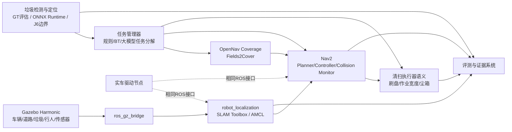

# 项目技术规范：智慧环卫无人清扫车仿真主线

## Stage5BR5 相机、审计与观测位姿契约

- 主动观察候选必须分别保存 `first_seen_s`、`last_seen_s`、`queued_at_s`、`preflight_started_s`、`approach_started_s`、`approach_deadline_s` 与 `last_observation_s`；sensor stale 不得与 queue timeout 混用，approach timeout 必须包含路径长度/最小速度项。
- verification 相机候选必须同时保存 base_link 和保险杠相对坐标，并按车体、保险杠、刷盘、机械臂预留体积、地面、安装高度、旋转 AABB 与 footprint 做实际机械门。生产 footprint 只有在相机选择通过后才能修改。
- 相机运行消融至少覆盖六世界、每 role 10 组同步帧，并报告 self pixels、target/self overlap、bbox/mask/depth、可见比例与 boundary completeness。静态同 pose view replay 不得命名为主动观察。
- 人工可辨识门必须使用五类各至少 40 张、至少六世界的平衡盲审集和两名独立评审；脚本不能代替人工。准确率 `>=0.90`、Cohen kappa `>=0.75`、self-occlusion failure `<=0.05` 才通过。
- policy v1 不修改；policy v2 在人工审计完成前不得冻结或允许训练。任何阈值变化使用新 policy id 与新 SHA-256。
- Observation pose planner 必须包含 ROS-independent 几何核心和 Nav2 `ComputePathToPose` wrapper；无可达候选时进入 `UNREACHABLE`，不得用 GT 直接输出车辆最终位姿。
- 只有机械、运行时、人工和正式六世界 oracle active-observation 门全部通过，才允许进入 detector/area micro-overfit 与 120/1200 screening。

## Stage5BR4 感知可评测与主动观察契约

感知报告必须保留 `all_visible`、`recognition_ready`、`non_ready` 三个互斥视图。离散类 ready 以最短边、mask area 和最大深度联合判定；区域类独立使用 mask area 门。阈值在训练前冻结并记录 SHA-256，修改必须新建 policy id 和人工审计证据。

主动观察使用稳定 candidate-id 关联 discovery 与 recognition，状态为 `DISCOVERED`、`OBSERVATION_QUEUED`、`APPROACH_PREFLIGHT`、`APPROACHING`、`RECOGNITION_READY`、`CONFIRMED`、`REJECTED`、`UNREACHABLE`。只有 component 边界、ComputePath、keepout、footprint、visibility 和定位不确定性均通过才能接近；stale、timeout、不可达和最大次数均 fail-closed，并记录额外里程与时间。

C0 是生产默认单相机；C1/C2 只用于消融；C3 verification 相机和所有训练 GT/self-mask 默认关闭。生产控制不得订阅这些训练话题。

## Stage5BR3 G2 真实车辆数据与筛选契约

- G2 必须使用实际 `sanitation_vehicle` 的生产相机外参、内参、光学帧和车辆运动；禁止独立静态相机 rig。semantic/instance GT 只能由默认关闭的训练开关挂载，生产 Xacro/launch 和控制订阅不得包含 GT。
- 至少六个材料、几何、布局和 SHA 均不同的世界，按 3/1/2 固定分给 train/val/test；目标、hard negative、轨迹族和相邻帧不得跨 split 泄漏，测试 split 不得参与模型选择。
- screening 数据为 80 scene/800 frame，每场景 10 帧且相邻帧车辆位移至少 0.25 m；逐实例保存 bbox、最短边、mask area、距离、遮挡与可见性，并检查 semantic-instance 一致、negative-only、exact/pHash 重复。
- 原生相机只采集一次，再离线扫描 256×192、384×288、512×384 与 640×384。离散目标使用置信度排序 detector 指标，leaf/puddle 使用 area segmentation 指标，不得把 IoU 匹配值冒充 AP。
- architecture screening 最多三次；只有 detector in-domain F1 ≥0.90、cross-world F1 ≥0.70、small-object recall ≥0.70、area cross-world mIoU ≥0.75、color-stress F1 ≥0.60、same-color negative FP ≤0.05/frame 全部通过，才允许扩大到 500/5000。
- 场景 manifest 中的曝光、白平衡、噪声、模糊或动态障碍“请求”不等于已在 Gazebo 原生图像逐项施加；缺少实际执行证据时必须明确保留为边界。
- screening 失败后，500/5000、30-seed/10-min live、真实 Nav2 spot-clean、真实域和 J6 均保持未执行，readiness 必须为 false。

## Stage5BR G1 数据与训练链契约

- `P1` 仅指 NumPy/OpenCV 程序化筛查；`G1` 必须来自 Gazebo Harmonic 实际 RGB-D 与 SegmentationCamera topics，二者不得混名。
- G1 RGB、depth、semantic、instance 必须同 pose、同分辨率/FOV、同仿真时间戳；CameraInfo、固定/动态 transform、world/registry/scene hash 和 annotation source 必须落盘。
- 整个 scene 只属于一个 split；asset 不得跨 train/val/test，测试集不得用于结构或 checkpoint 选择。
- 训练链进入 G1 前必须通过 micro F1 ≥0.98、micro mIoU ≥0.95、PyTorch/ONNX logit error ≤1e-4 和 argmax agreement ≥99.99%。
- 50 scene/500 frame 只用于 smoke 与 screening；只有 in-domain F1 ≥0.90、leaf/puddle mIoU ≥0.75、cross asset/world F1 ≥0.70、color stress F1 ≥0.60 后，才允许扩到正式 500 scene/5000 frame。

## Stage5B 学习型感知契约

- D0 固定颜色模型只作 Stage5A 回归基线；Stage5B 候选必须从随机初始化经优化器训练，模型卡必须记录数据域、种子、环境、候选选择和权重来源。
- D1 正式门必须使用 Gazebo 相机实际渲染的 RGB-D，不得把 NumPy/OpenCV 程序化图像命名为 Gazebo camera 数据。scene、asset、texture、world 和相邻帧必须按合同隔离，测试集不得参与候选选择。
- 每类至少六个许可明确的变体，并加入同色异类、异色同类、背景换色、纹理/形状、曝光和积水混淆等压力测试；颜色捷径失败即停止正式端到端推进。
- AP 只有在保留置信度排序预测并形成 precision-recall 曲线时才可报告；IoU 匹配 Jaccard 分数不得命名为 AP。
- D2 真实数据、J6 转换/量化、J6 实板运行、真实 Nav2 spot-clean 和竞赛效率均是独立 fail-closed 门，禁止以 ONNX 可加载、单次 Gazebo 运行或理论接口兼容替代。

## Stage5A 感知与定点清扫契约

- 类别必须由版本化 registry 的精确 Gazebo identity 解析；模型名子串不得决定目标/障碍语义。
- 正式 x86 仿真后端为 ONNX Runtime；GT 仅用于标注与评估，进入决策 tracker 必须 fail-closed；J6 不可用时不得回退伪装。
- RGB、depth、camera_info 和 TF 必须共同形成 2D、3D、分割与 `map` 目标；任何关键输入缺失时 map 输出 fail-closed 并记录原因。
- train/val/test 按 scene seed 分割，COCO detection/segmentation、map pose、相机参数、TF、场景 manifest、split hash 和重复图像检查均须保留。
- spot-clean 默认 `deferred`，状态为 TENTATIVE、CONFIRMED、QUEUED、APPROACHING、CLEANING、CLEANED、LOST、REJECTED；同一目标不得逐帧重复建任务。
- synthetic、真实数据、J6、实车与竞赛效率是互相独立的门，禁止跨门替代。

## Stage4W 完整任务契约

- 规划、执行与评测必须使用同一份编译后的 mission geometry，包括 outer、headland、keepout、显式 exclusion、world→map 固定障碍、footprint 和安全裕量。
- staging 必须经当前全局 costmap、keepout/speed mask、footprint clearance 和 ComputePathToPose 验证；costmap 未覆盖候选点时不得提前规划。
- Coverage 硬门要求当前统一几何生成的全部组件终态成功。当前几何为 9 swath + 8 turn = 17；历史固定 23 组件口径不适用。
- 动态障碍服务必须 fail-closed；20 次有效交互均需 set-pose 成功、路径走廊命中、LiDAR 观测、碰撞 0 和任务恢复推进。
- 覆盖期定位沿用 Stage4V-compatible 每 seed XY RMSE ≤0.05 m；GT 仅评分，不参与控制。
- 急停 P95 必须 ≤1 s；上游失联必须观察到连续稳定零输出。竞赛效率单独按作业宽度×速度×3600 计算，不能用覆盖率替代。

## Stage4U 定位评测契约

- 坐标变换统一命名为 `T_target_source`，使用同一冻结标定覆盖全部 seed，禁止逐 trial 拟合。
- 正式精度以 map-relative localization error 为主；地图地理配准误差独立报告，不与定位器误差相加后冒充单一指标。
- AMCL 粒子话题类型为 `nav2_msgs/msg/ParticleCloud`，订阅 QoS 必须与运行时 publisher 兼容；0 次有效更新一律 fail-closed。
- 地图的 generation/basic-quality/localization-geometry 三个门彼此独立；surveyed reference 只属于定位基线，不属于 SLAM 建图成绩。
- 正式 10-seed 只有在有效同步样本、导航完成、TF 连续和必需粒子仪器有效时才计入完成种子。

## 1. 目标

构建一套面向“仿真 + 实车”并行开发的 ROS 2 仿真底座，使同一套上层算法可以在 Gazebo 和实车之间切换。第一轮目标不是追求高精度外观模型，而是先完成：

1. 可运行的清扫车 URDF/Xacro；
2. 可复现的环卫场景；
3. 建图、定位、导航、循迹和区域全覆盖；
4. 感知接口和垃圾对象真值；
5. 动态避障、急停和任务恢复；
6. 自动化指标采集；
7. 为地平线 J6 推理节点预留 ROS 2 接口。

## 2. 架构

## 3. 主接口

### 3.1 底盘与传感器

- `/cmd_vel_gate` — `geometry_msgs/msg/Twist`，Nav2/任务侧进入最终安全门的命令
- `/cmd_vel` — `geometry_msgs/msg/Twist`，仅由最终安全门向车辆发布
- `/odom/unfiltered` — `nav_msgs/msg/Odometry`，保留的原始轮速里程计
- `/measurements/wheel_odom` — `nav_msgs/msg/Odometry`，规范 frame 并注入非零 covariance 的轮速量测
- `/measurements/imu` — `sensor_msgs/msg/Imu`，规范 frame 并注入非零 covariance 的 IMU 量测
- `/odom` — `nav_msgs/msg/Odometry`，selected EKF 的融合输出
- `/ground_truth/odom` — `nav_msgs/msg/Odometry`，仅用于评分；除显式 `oracle_only` 隔离通道外不得参与控制
- `/tf`, `/tf_static`
- `/scan` — `sensor_msgs/msg/LaserScan`
- `/imu/data` — `sensor_msgs/msg/Imu`，永久保留的原始 IMU topic
- `/camera/color/image_raw`
- `/camera/color/camera_info`
- `/camera/depth/image_rect_raw`
- `/camera/depth/color/points`

### 3.2 环卫任务接口

第一阶段允许使用标准消息，后续再固化自定义 action。

- `/cleaning/enable` — `std_msgs/msg/Bool`
- `/cleaning/brush_speed` — `std_msgs/msg/Float32`
- `/cleaning/bin_fill_ratio` — `std_msgs/msg/Float32`
- `/emergency_stop` — `std_msgs/msg/Bool`
- `/perception/garbage/detections_2d` — `vision_msgs/msg/Detection2DArray`
- `/perception/garbage/detections_3d` — `vision_msgs/msg/Detection3DArray`
- `/perception/garbage/segmentation` — `sensor_msgs/msg/Image`
- `/perception/garbage/targets` — `sanitation_perception_interfaces/msg/GarbageTargetArray`
- `/perception/garbage/diagnostics` — `std_msgs/msg/String`
- `/garbage/ground_truth` — `sanitation_perception_interfaces/msg/GarbageTargetArray`，仅标注/评估
- `/garbage/cleaning_events` — `sanitation_perception_interfaces/msg/CleaningEvent`
- `/spot_clean/state` — `std_msgs/msg/String`
- `/coverage/path` — `nav_msgs/msg/Path`
- `/metrics/coverage_ratio` — `std_msgs/msg/Float32`

### 3.3 J6 推理边界

J6 节点只承担推理和必要预处理，保持与仿真/主控解耦：

输入：

- 图像或压缩图像；
- 可选深度图；
- 模型配置与阈值。

输出：

- `vision_msgs/msg/Detection2DArray`；
- 可选 `Detection3DArray`；
- 运行耗时、置信度、模型版本和量化版本。

## 4. 车辆模型原则

- 先使用参数化几何体，禁止在第一阶段花大量时间制作外观网格；
- 底盘默认使用 4WD skid-steer，真实底盘若为 Ackermann，再新增并行车型；
- 清扫宽度默认 0.65 m；
- 尘箱几何容积 0.04 m³，即 40 L；
- 保留 `arm_mount_link`，为抓取演示预留安装位；
- 传感器坐标必须集中配置，不散落硬编码；
- 碰撞几何简化，视觉几何可后续替换；
- 仿真和实车必须使用相同 frame 命名。

## 5. 场景原则

基础测试场景至少包含：

- 直路和转弯；
- 600 mm 以上清扫通道；
- 狭窄路段；
- 路缘/禁行区；
- 锥桶、垃圾桶和箱体障碍；
- 瓶、罐、纸盒等离散垃圾；
- 落叶堆；
- 不超过 1 cm 的低摩擦积水区域；
- 后续加入行人和移动障碍。

所有模型应使用项目自建 primitive 或许可证清晰的资源，不依赖运行时在线下载 Fuel 模型。

## 6. 工程约束

- 不修改第三方仓库源码；通过 overlay 包、参数和 launch 文件集成；
- 第三方版本必须锁定到分支、tag 或 commit；
- 所有脚本可重复执行；
- 支持 `gui:=false` 的 headless 模式；
- 每个阶段必须有可自动判定的验收脚本；
- 所有结果落盘到 `artifacts/<timestamp>/`；
- 禁止只以“RViz 看起来能跑”作为完成标准；
- 不得伪造运行日志、截图或指标。

## 7. 第一 GPT 复核门

Codex 推进到以下状态后停止：

1. 仿真一键启动；
2. 车辆可稳定接收 `/cmd_vel`；
3. LiDAR、相机、IMU、里程计、TF 正常；
4. SLAM 和 Nav2 可启动；
5. 完成一个多边形区域的覆盖路径规划和跟踪；
6. 生成自动化评测 JSON；
7. 打包完整证据；
8. 输出剩余风险和下一阶段建议。

感知模型训练、J6 量化、大模型任务分解和机械臂抓取不应在第一复核门前大规模展开。
